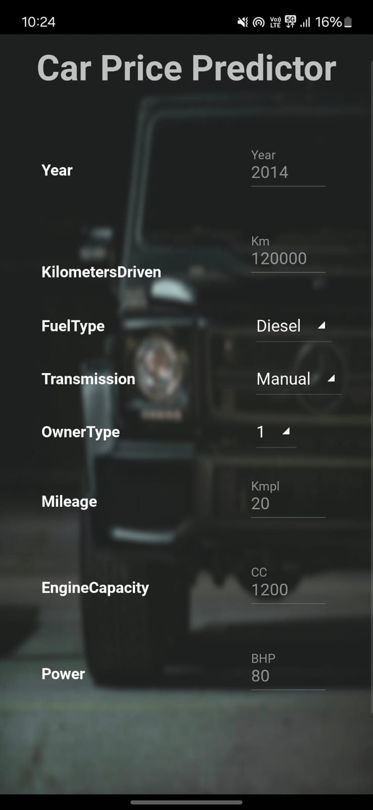
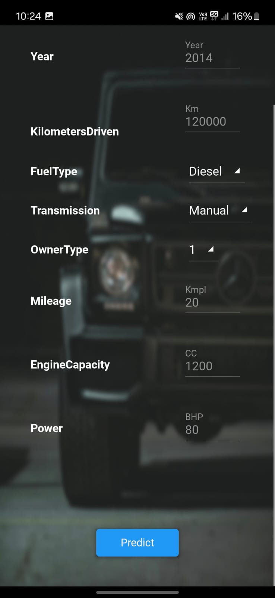
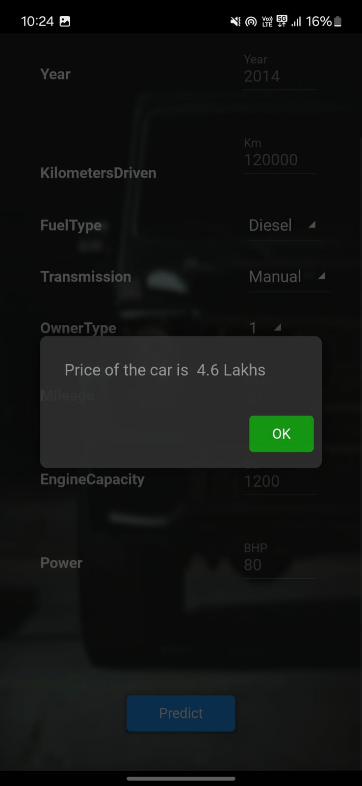

# Andriod-Application

> It is a **Machine Learning Andriod Application** which can predict the price of used cars in India based on the features like **Year of manufacture, Kilometers Driven, Fuel Type, Transmission Type, Power, Engine Capacity**, etc.
>
> A regression model was created using the dataset, an **UI** was created using Python and the Python Kivy module, which is popular for creating Android applications. The model was hosted on a Render platform server, and API requests are handled using **FLASK API**.
>
> ### Directory Structure

- **[DUNE-APP](DUNE-APP)**: Contains the main application code.
- **[DUNE-JUSTUI](DUNE-JUSTUI)**: Includes the code for the user interface.
- **[DUNE-MODEL](DUNE-MODEL)**: Contains the machine learning model code.
- **[FLASK](FLASK)**: Contains the Flask application code for handling API requests.

> ## App View
>    

